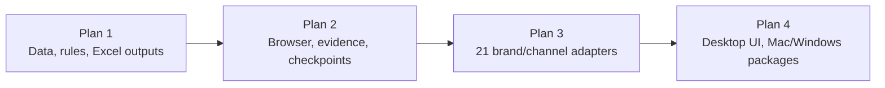

# Fujian Mobile Quotation Automation Implementation Plan Suite

> **For agentic workers:** REQUIRED SUB-SKILL: Use superpowers:subagent-driven-development (recommended) or superpowers:executing-plans to implement this plan task-by-task. Steps use checkbox (`- [ ]`) syntax for tracking.

**Goal:** Execute the approved Fujian Mobile quotation-automation design through four independently testable implementation plans.

**Architecture:** The plans progress from a pure local Excel core, to persistent browser/evidence infrastructure, to seven-brand site adapters, and finally to the desktop application and Mac/Windows packages. Each plan has its own completion gate and must pass before the next plan begins.

**Tech Stack:** Python 3.12, tkinter/ttk, openpyxl, Playwright with installed Chrome/Edge, SQLite, mss, Pillow, pytest, PyInstaller.

## Global Constraints

- The approved design is `docs/superpowers/specs/2026-07-25-fujian-mobile-quotation-automation-design.md`.
- Work is fully local except direct access to target commerce and official websites.
- Do not begin a later plan until the preceding plan completion gate passes.
- Use test-driven development and create a focused commit after every task.
- Preserve user files and unrelated worktree changes.
- Never bypass login security, CAPTCHA, or risk control.
- Mac is the pilot platform; Windows is the primary formal-delivery platform.

---

## Execution Order

1. [Core Data and Excel Plan](2026-07-25-01-core-excel-implementation.md)
2. [Browser Runtime and Screenshot Evidence Plan](2026-07-25-02-browser-evidence-implementation.md)
3. [Seven-Brand Site Adapter Plan](2026-07-25-03-site-adapters-implementation.md)
4. [Desktop Integration and Cross-Platform Packaging Plan](2026-07-25-04-desktop-packaging-implementation.md)

## Dependency Map

## Requirement Coverage

| Approved design area | Implementation owner |
|---|---|
| Three input files, Base-A row generation, exact joins | Plan 1 Tasks 2–4 |
| Current-month default and rolling historical months | Plan 1 Tasks 1–3 |
| Manual blanks, V/W rules, formulas, lowest-price tie | Plan 1 Tasks 5–7 |
| One-sheet quotation template and exact formatting | Plan 1 Tasks 6–7 |
| Excel execution report | Plan 1 Task 8, extended in Plan 3 Task 7 |
| Persistent login and installed Chrome/Edge | Plan 2 Tasks 2 and 4 |
| Checkpoint, pause/resume, retry only failures | Plan 2 Tasks 3, 4, and 6 |
| True full-screen Mac/Windows evidence and red frames | Plan 2 Task 5 |
| Seven supported brands and unsupported-brand handling | Plan 3 Tasks 3 and 6 |
| JD/Tmall/official price and business-“无” rules | Plan 3 Tasks 2, 4, 5, and 6 |
| AI:AN, AH/R/S, standard Excel images | Plan 3 Task 7 |
| Non-technical UI and shared result summary | Plan 4 Tasks 2–4 |
| Fully local app data and privacy-safe logs | Plan 4 Task 1 |
| Mac `.app` pilot | Plan 4 Task 5 |
| No-admin Windows portable package and strict screenshots | Plan 4 Task 6 |
| 200–300 row scale, restart, failure-only rerun | Plan 4 Task 7 |
| User instructions and release acceptance | Plan 4 Task 7 |

## Overall Completion Gate

The full project is complete only when all four plan completion gates pass and the final Windows acceptance proves:

- Base-A row count and order are preserved;
- formulas and month rolling are correct;
- 21 supported brand/channel combinations have acceptance evidence;
- normal and three legal-“无” screenshot states match the examples;
- a 300-row task survives interruption and resumes;
- partial failures still produce both Excel outputs;
- Excel and WPS display all standard embedded images;
- the program runs under a non-admin Windows account without Python installed;
- no business data leaves the local computer.
